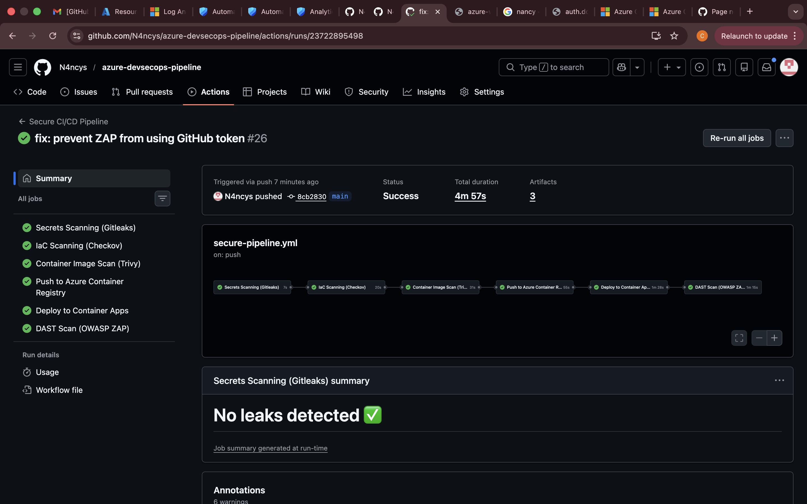
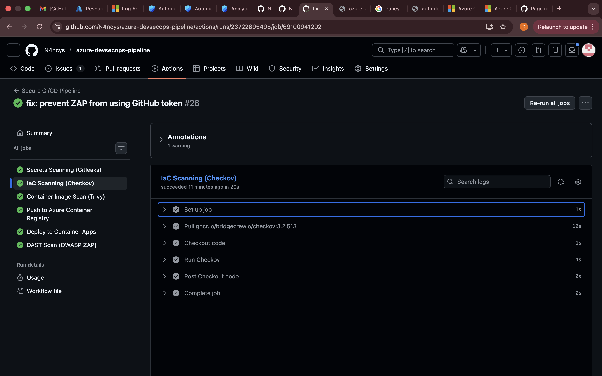
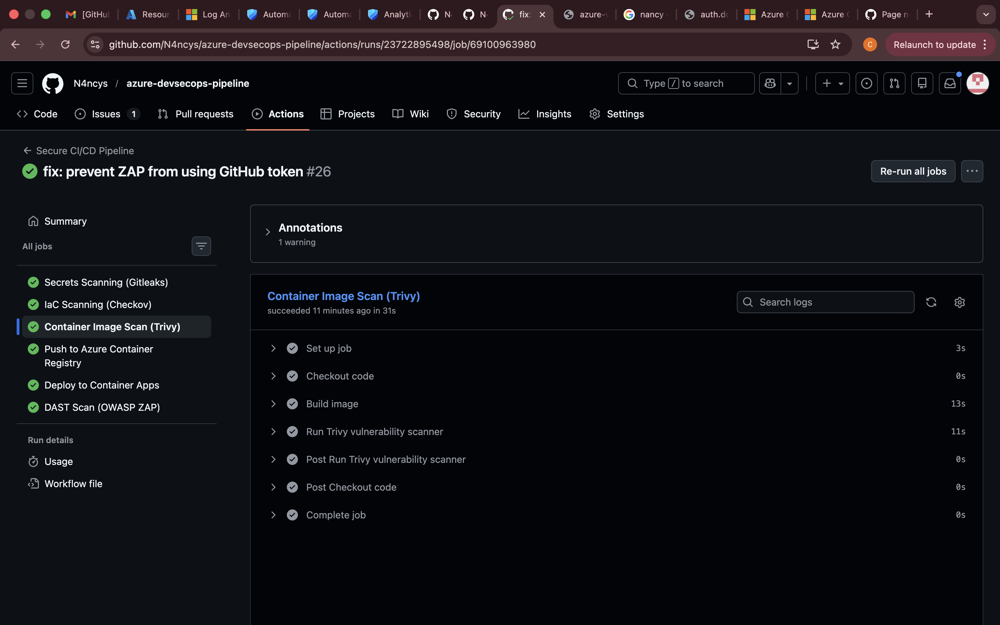
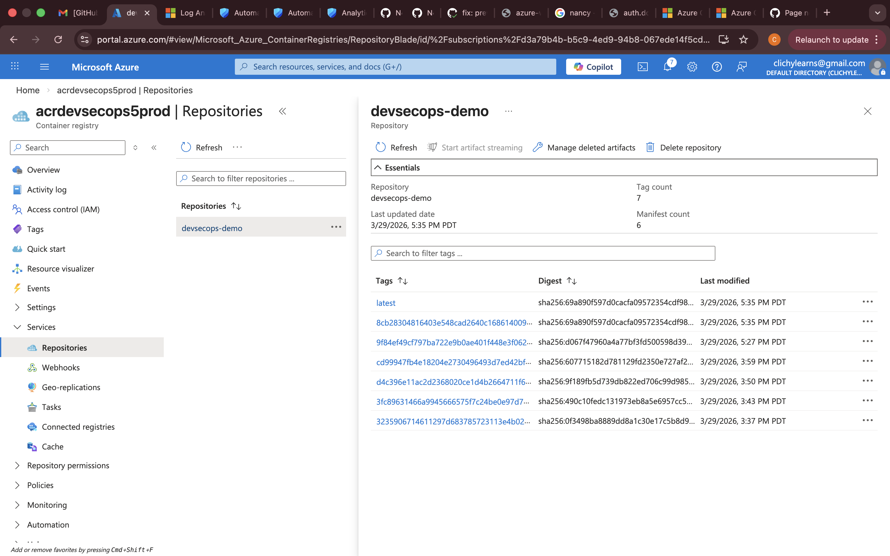
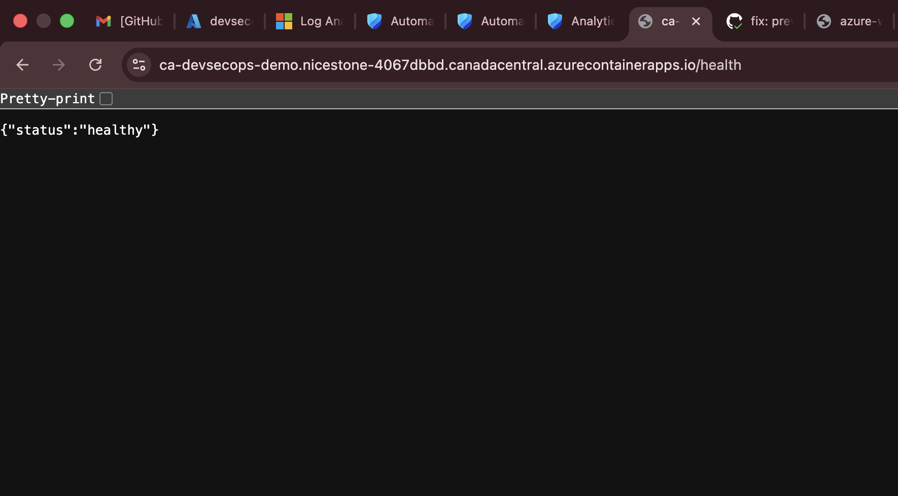
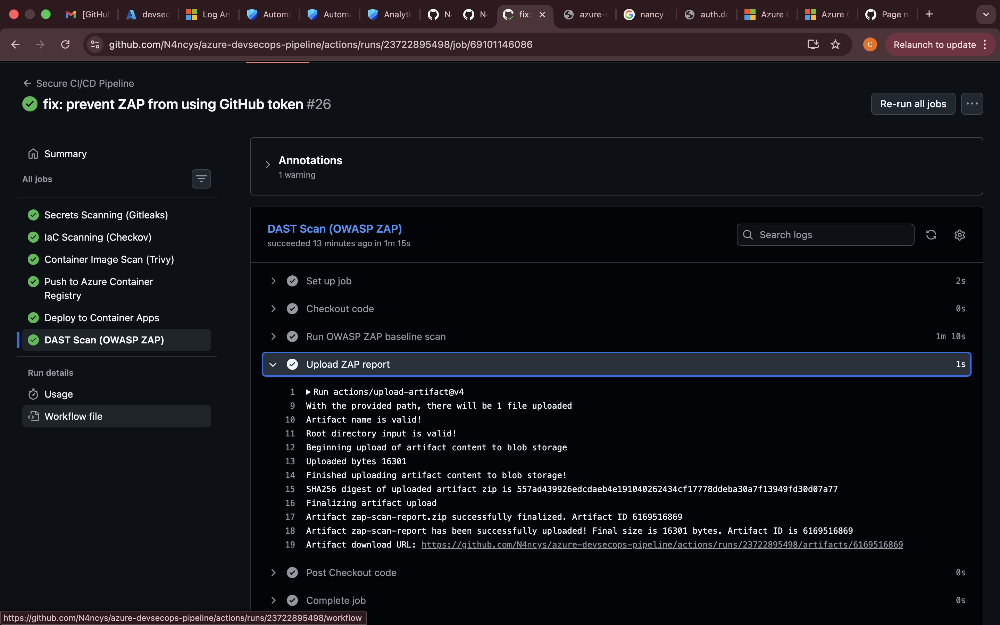

# DevSecOps: Secure CI/CD Pipeline on Azure
End-to-end DevSecOps pipeline on Azure — SAST, secrets detection, IaC scanning, container image scanning, and DAST with automated pipeline gates. Fully provisioned as code using Terraform


A production-grade secure CI/CD pipeline built on Azure and GitHub Actions. Implements shift-left security with automated gates that fail the build on critical findings. No hardcoded credentials anywhere in the pipeline.

---

## Pipeline Overview



Every code push triggers a 6-stage security pipeline. Each stage is a gate — a critical finding stops the pipeline and nothing ships.
```
Push to GitHub
      │
      ▼
[1] Secrets Scan (Gitleaks)        ── blocks hardcoded credentials
      │
      ▼
[2] IaC Scan (Checkov)             ── blocks Terraform misconfigurations
      │
      ▼
[3] Container Image Scan (Trivy)   ── blocks CRITICAL CVEs in the image
      │
      ▼
[4] Push to Azure Container Registry
      │
      ▼
[5] Deploy to Azure Container Apps
      │
      ▼
[6] DAST Scan (OWASP ZAP)          ── tests the live running app
```

---

## Security Gates

### 1. Secrets Scanning — Gitleaks
Scans the full git history for hardcoded secrets, API keys, and passwords on every push.

**Result:** No leaks detected across all commits.

### 2. IaC Scanning — Checkov
Scans all Terraform code for misconfigurations before anything is deployed. Findings that were fixed include missing Key Vault firewall rules and disabled purge protection. SKU-limited checks are suppressed with documented reasons.



### 3. Container Image Scanning — Trivy
Builds the Docker image and scans it for known CVEs in OS packages and application dependencies. Pipeline fails on any CRITICAL finding.



### 4. Push to Azure Container Registry
Image is pushed to ACR using Workload Identity Federation — no stored credentials in GitHub. Admin access on ACR is disabled, forcing identity-based authentication only.



### 5. Deploy to Azure Container Apps
Deploys the verified image to Azure Container Apps using a User-Assigned Managed Identity. The app is live and healthy after every successful pipeline run.



### 6. DAST Scanning — OWASP ZAP
Runs a baseline attack scan against the live deployed app. ZAP tests for SQL injection, XSS, missing security headers, authentication flaws, and more. Results are uploaded as a pipeline artifact.



**ZAP Results:** 0 FAIL · 6 WARN · 64 PASS

---

## Infrastructure

All Azure resources are provisioned as code using Terraform. No manual portal configuration.

| Resource | Purpose |
|---|---|
| Azure Container Registry | Stores Docker images with identity-based auth |
| Azure Container Apps | Runs the application |
| Azure Container Apps Environment | Managed runtime with Log Analytics integration |
| Key Vault | Runtime secrets storage with firewall rules |
| User-Assigned Managed Identity | Zero-credential authentication for pipeline and app |
| Log Analytics Workspace | Centralised logging |

---

## Security Design Decisions

**Workload Identity Federation** — GitHub Actions authenticates to Azure by exchanging a GitHub OIDC token for an Azure access token. No client secrets or passwords stored anywhere.

**Admin disabled on ACR** — Forces all image pulls and pushes to use managed identity. Eliminates username/password attack surface.

**Non-root container** — The Docker image runs as a dedicated `appuser`, not root. Limits blast radius if the container is compromised.

**Key Vault firewall** — Default deny with AzureServices bypass. Public network access disabled.

**Purge protection on Key Vault** — Prevents accidental or malicious deletion of secrets.

**Checkov suppressions documented** — Every skipped check has a documented reason. No blind ignoring of findings.

---

## Tech Stack

- **Pipeline:** GitHub Actions
- **IaC:** Terraform
- **Secrets Scanning:** Gitleaks
- **IaC Scanning:** Checkov
- **Image Scanning:** Trivy
- **DAST:** OWASP ZAP
- **Registry:** Azure Container Registry
- **Runtime:** Azure Container Apps
- **Auth:** Workload Identity Federation + Managed Identity
- **App:** FastAPI (Python)

---

## Repository Structure
```
├── .github/workflows/
│   └── secure-pipeline.yml    # Full 6-stage pipeline
├── app/
│   ├── main.py                # FastAPI application
│   ├── requirements.txt
│   └── Dockerfile             # Non-root, slim base image
├── terraform/
│   ├── main.tf                # All Azure resources
│   ├── variables.tf
│   ├── outputs.tf
│   └── providers.tf
├── security/
│   ├── .gitleaks.toml         # Gitleaks config
│   ├── checkov-baseline.json  # Suppression documentation
│   └── zap-baseline.conf      # ZAP config
└── screenshots/               # Pipeline evidence
```

---

## Part of Azure Cloud Security Portfolio

| # | Project |
|---|---|
| 1 | Azure Secure Landing Zone |
| 2 | Cloud Native FastAPI on Azure Container Apps |
| 3 | Secure AKS Deployment |
| 4 | Cloud Security Monitoring & Incident Response |
| **5** | **DevSecOps: Secure CI/CD Pipeline** |
